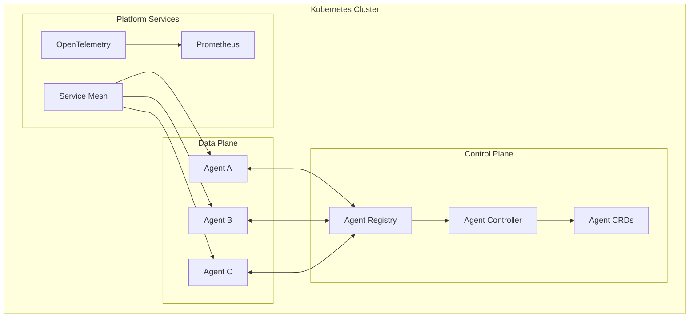
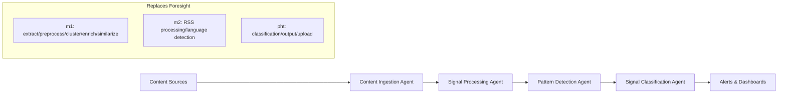

# Agent-to-Agent Interoperability Platform

Modern agent-based architecture demonstrating real-world A2A communication through the **Signal Detection Platform** - a production-ready modernization of the Public Health Agency of Canada's Foresight signal detection system.

[](https://opensource.org/licenses/MIT)
[](https://kubernetes.io/)
[](https://cncf.io/)

## Overview

This project demonstrates agent-to-agent interoperability through a concrete, meaningful implementation: modernizing public health signal detection. Instead of toy examples, we've built a production-ready system that replaces traditional pipeline processing with coordinated agents.

**Signal Detection Platform** (`./signal-detection/`) transforms the Foresight platform's complex m1/m2/pht module architecture into 5 clean, coordinated agents that handle the complete signal detection workflow.

### Key Features

- **A2A Protocol Implementation**: JSON-RPC 2.0 over HTTP/WebSocket with streaming support
- **Kubernetes Native**: Custom Resource Definitions (CRDs) for agent lifecycle management
- **Security First**: mTLS, RBAC, and SPIFFE integration for zero-trust communication
- **Cloud Native Observability**: OpenTelemetry, Prometheus metrics, and distributed tracing
- **Multi-Cluster Ready**: Federation and cross-cluster agent discovery
- **MCP Integration**: Built-in Model Context Protocol support for enhanced agent capabilities
- **Helm Deployment**: Production-ready charts with configurable environments
- **Infrastructure as Code**: OpenTofu modules for reproducible deployments

## Architecture



### Core Components

- **Agent Registry**: Service discovery and health monitoring
- **Agent Controller**: Kubernetes-native lifecycle management
- **Communication Layer**: A2A protocol with MCP integration
- **Observability Stack**: Metrics, logging, and distributed tracing
- **Security Framework**: Authentication, authorization, and encryption

## Signal Detection Platform

The primary implementation demonstrates agent coordination through public health signal detection:

### Quick Start

```bash
# Clone the repository
git clone https://github.com/simardeep1792/open-agent-platform.git
cd open-agent-platform

# Deploy the signal detection platform
cd signal-detection
./scripts/deploy-signal-detection.sh

# Start monitoring and access
./dev/start-monitoring.sh
```

### Architecture Overview

The Signal Detection Platform replaces Foresight's traditional processing modules with 5 coordinated agents:



### Core Agents

1. **Content Ingestion Agent** - Unified processing for JSON documents, RSS feeds, APIs (replaces m1 extraction + m2 RSS logic)
2. **Signal Processing Agent** - Modern NLP and entity extraction (replaces m1 preprocessing + m2 language detection)
3. **Pattern Detection Agent** - Clustering, similarity, and anomaly detection (replaces m1 clustering + m2 clustering)
4. **Signal Classification Agent** - Multi-category classification and alerting (replaces pht multi-cat-classifier + output logic)

### Simplified from Foresight

- **No m1/m2/pht separation**: Logical agent flow instead of module boundaries
- **Modern NLP**: Transformer models instead of legacy preprocessing
- **Agent coordination**: Replaces manual GPU coordination scripts
- **Unified data processing**: Source-agnostic content handling

## Agent Development

### Creating an Agent

Agents are defined using Kubernetes Custom Resources:

```yaml
apiVersion: a2a.io/v1
kind: Agent
metadata:
  name: weather-agent
  namespace: default
spec:
  name: Weather Service Agent
  version: "1.0.0"
  description: Provides weather information and forecasts
  capabilities:
    - id: "weather.current"
      name: "Get Current Weather"
      description: "Retrieve current weather conditions"
      modalities: ["text"]
      inputSchema:
        type: object
        properties:
          location:
            type: string
            description: "City name or coordinates"
        required: ["location"]
      outputSchema:
        type: object
        properties:
          temperature:
            type: number
          conditions:
            type: string
          humidity:
            type: number
  endpoints:
    - type: http
      port: 8080
      path: /
      tls: true
  authentication:
    type: mtls
  resources:
    requests:
      cpu: 100m
      memory: 128Mi
    limits:
      cpu: 500m
      memory: 512Mi
```

### Agent Implementation

```typescript
import { Agent, AgentCapability } from '@open-agent-platform/sdk';

class WeatherAgent extends Agent {
  constructor() {
    super({
      name: 'weather-agent',
      version: '1.0.0',
      capabilities: [
        new AgentCapability({
          id: 'weather.current',
          handler: this.getCurrentWeather.bind(this)
        })
      ]
    });
  }

  async getCurrentWeather(params: { location: string }) {
    // Implementation here
    return {
      temperature: 22,
      conditions: 'sunny',
      humidity: 45
    };
  }
}

// Start the agent
const agent = new WeatherAgent();
await agent.start();
```

## Configuration

### Environment Variables

| Variable | Description | Default |
|----------|-------------|---------|
| `OAPF_LOG_LEVEL` | Log level (debug, info, warn, error) | `info` |
| `OAPF_REGISTRY_URL` | Agent registry endpoint | `http://oapf-registry:8080` |
| `OAPF_METRICS_ENABLED` | Enable Prometheus metrics | `true` |
| `OAPF_TRACING_ENABLED` | Enable OpenTelemetry tracing | `true` |
| `OAPF_TLS_ENABLED` | Enable mTLS communication | `true` |

### Helm Values

Key configuration options:

```yaml
platform:
  # Global platform settings
  logLevel: info
  domain: oapf.local
  
registry:
  # Agent registry configuration
  replicas: 3
  persistence:
    enabled: true
    size: 10Gi

security:
  # Security settings
  mtls:
    enabled: true
  rbac:
    enabled: true
  networkPolicies:
    enabled: true

observability:
  # Monitoring and tracing
  prometheus:
    enabled: true
  jaeger:
    enabled: true
  grafana:
    enabled: true
```

## Infrastructure

### OpenTofu Modules

Deploy infrastructure using OpenTofu:

```bash
# Initialize infrastructure
cd infrastructure/
tofu init

# Plan deployment
tofu plan -var-file="environments/production.tfvars"

# Apply infrastructure
tofu apply
```

### Supported Platforms

- **AWS EKS**: Complete integration with AWS services
- **Google GKE**: Native GCP service integration
- **Azure AKS**: Azure-specific optimizations
- **On-Premises**: Self-managed Kubernetes clusters

## Security

### Zero-Trust Architecture

- **mTLS**: All inter-agent communication encrypted
- **SPIFFE/SPIRE**: Cryptographic identity for agents
- **RBAC**: Kubernetes-native role-based access control
- **Network Policies**: Microsegmentation at the network layer
- **Pod Security Standards**: Enforced security contexts

### Compliance

- SOC 2 Type II ready
- GDPR compliant data handling
- HIPAA-eligible deployment patterns
- FedRAMP considerations included

## Observability

### Metrics

- Agent health and performance metrics
- Communication latency and throughput
- Resource utilization tracking
- Business-specific KPIs

### Logging

- Structured JSON logging
- Correlation IDs for request tracing
- Centralized log aggregation
- Alert integration

### Tracing

- Distributed tracing across agent calls
- Performance profiling
- Error tracking and analysis
- Dependency mapping

## Model Context Protocol (MCP)

The platform provides built-in MCP support for enhanced agent capabilities:

```typescript
import { MCPAgent, Tool, ContextStore } from '@open-agent-platform/mcp';

class EnhancedAgent extends MCPAgent {
  constructor() {
    super({
      tools: [
        new DatabaseTool(),
        new APITool(),
        new FileTool()
      ],
      contextStore: new RedisContextStore()
    });
  }
}
```

## Contributing

We welcome contributions! Please see our [Contributing Guide](CONTRIBUTING.md) for details.

### Development Workflow

1. Fork the repository
2. Create a feature branch
3. Make your changes
4. Add tests and documentation
5. Submit a pull request

### Code Quality

- TypeScript with strict type checking
- ESLint and Prettier for code formatting
- Comprehensive test coverage
- Security scanning with Snyk
- Dependency vulnerability checks

## Community

- **Documentation**: [docs.open-agent-platform.io](https://docs.open-agent-platform.io)
- **Discord**: [Join our community](https://discord.gg/open-agent-platform)
- **Discussions**: [GitHub Discussions](https://github.com/simardeep1792/open-agent-platform/discussions)
- **Issues**: [Report bugs or request features](https://github.com/simardeep1792/open-agent-platform/issues)

## License

This project is licensed under the MIT License - see the [LICENSE](LICENSE) file for details.

## Acknowledgments

- [Google's Agent2Agent Protocol](https://github.com/google-a2a/A2A)
- [Anthropic's Model Context Protocol](https://modelcontextprotocol.io/)
- [Cloud Native Computing Foundation](https://cncf.io/)
- [Kubernetes Community](https://kubernetes.io/community/)

---

**Built for the cloud-native agent ecosystem**