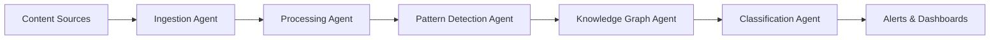

# Signal Detection Platform

Agent-based modernization of the Foresight signal detection platform, focused on production-ready public health intelligence.

## Architecture Overview

This system replaces Foresight's m1/m2/pht module complexity with 5 coordinated agents that handle the complete signal detection pipeline.

### Core Agents

1. **Content Ingestion Agent** - Unified ingestion for all source types
2. **Signal Processing Agent** - Modern NLP and entity extraction  
3. **Pattern Detection Agent** - Clustering, similarity, and anomaly detection
4. **Knowledge Graph Agent** - Relationship management and querying
5. **Signal Classification Agent** - Multi-category classification and scoring

### Key Simplifications

- **Unified Processing**: No artificial m1/m2/pht separation
- **Modern NLP**: Transformer models instead of legacy preprocessing
- **Agent Coordination**: Replaces manual GPU coordination scripts
- **Cloud-Native**: Kubernetes-first design with auto-scaling
- **Production-Ready**: Built-in observability and fault tolerance

## Quick Start

```bash
# Deploy complete platform
./scripts/deploy-signal-detection.sh

# Access monitoring
./dev/start-monitoring.sh
```

## Agent Communication Flow



## Capabilities

- **Multi-source Ingestion**: JSON documents, RSS feeds, APIs
- **Real-time Processing**: Stream processing with agent coordination
- **Pattern Recognition**: Automated clustering and anomaly detection
- **Knowledge Graphs**: Entity relationships and semantic connections
- **Signal Classification**: Multi-category health signal scoring
- **Production Monitoring**: Grafana dashboards and alerting

## Directory Structure

```
signal-detection/
├── agents/           # Agent implementations
├── k8s/             # Kubernetes manifests
├── helm/            # Helm charts
├── config/          # Configuration templates
├── scripts/         # Deployment and management scripts
└── docs/            # Architecture and operations documentation
```